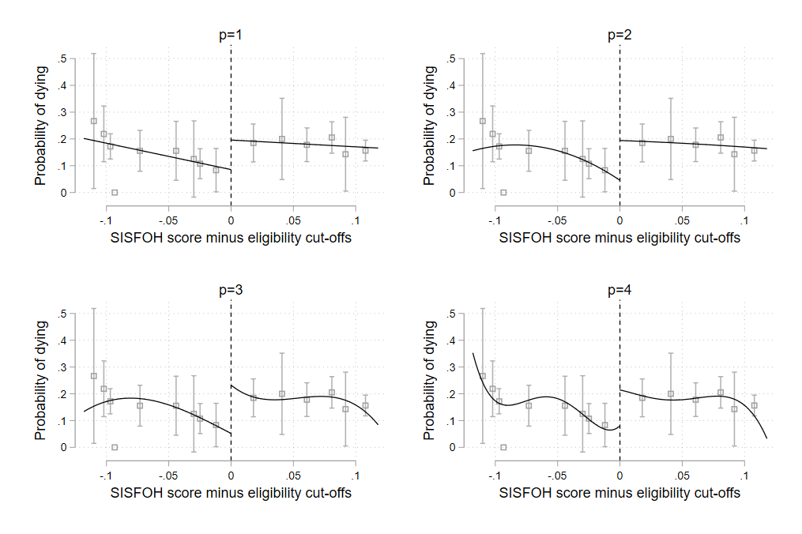
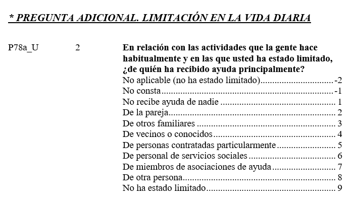
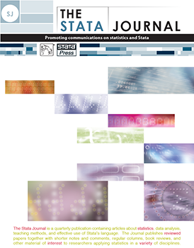
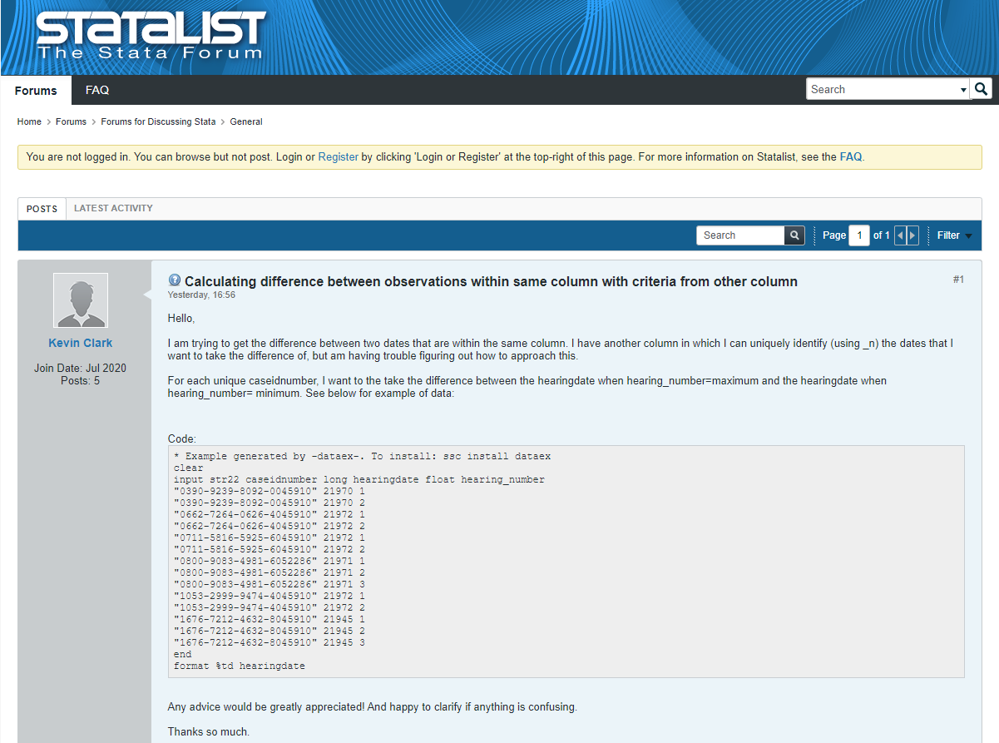

_ _ _

[Inicio](https://jtvalderrama.github.io/curso_stata.html) &nbsp;&nbsp;&nbsp;&nbsp; [Sesión 1](https://jtvalderrama.github.io/stata1.html)    &nbsp;&nbsp;&nbsp;&nbsp;   [Sesión 2](https://jtvalderrama.github.io/stata2.html)    &nbsp;&nbsp;&nbsp;&nbsp;   [Sesión 3](https://jtvalderrama.github.io/stata3.html)    &nbsp;&nbsp;&nbsp;&nbsp;   [Sesión 4](https://jtvalderrama.github.io/stata4.html)    &nbsp;&nbsp;&nbsp;&nbsp;   [Sesión 5](https://jtvalderrama.github.io/stata5.html) &nbsp;&nbsp;&nbsp;&nbsp;   [Ejercicios](https://jtvalderrama.github.io/stata_ejercicios.html) 

_ _ _

# 1. ¿Qué es Stata?

Es un programa estadístico que permite combinar,
  manipular y analizar datos usando métodos estadísticos y gráficos.

# 2. ¿Porqué Stata?

Versatilidad y popularidad frente a sus principales competidores, 
 `SPSS` y `SAS`; aunque cada vez es más extendido otras alternativas gratuitas como `R`.
  
## 2.1. Gráficos para publicación

# 3. Conceptos básicos

## 3.1. Formas de trabajo

Existen varias formas de trabajar con `Stata`:

* Emplear comandos de forma interactiva (e.g., como en Excel) $\rightarrow$ **Nada recomendado**
* Escribir archivos de comandos $\rightarrow$ **Muy recomendable**
* Generar un flujo de trabajo con otros programas, los que podemos exportar los resultados. Nunca copiar y pegar resultados (tedioso y lleva a incurrir  en muchos errores) $\rightarrow$ **Extremadamente recomendable**

Existe un importante número de libros de introducción a Stata, entre los que se pueden destacar los de @Acock2018 y, en español, @Escobar2012.

## 3.2. Tipos de archivos en Stata

### Archivos *.dta*

Son los archivos de datos de `Stata`, equivalentes a los archivos `.xlsx` en Excel o `.sav` en SPSS. Es el formato al que debemos convertir los datos con los que queramos trabajar.

### Archivos *.do*

Archivos de sintaxis de comandos, equivalentes a los `.sps` en SPSS. Resultan absolutamente básicos, para ahorrar tiempo (`Stata` no cuenta con la función *deshacer*) y garantizar la reproducibilidad. En realidad, son archivos de texto plano, idénticos a los `.txt`.

### Archivos *.smcl* o *.log*

Son archivos de registro, que recogen las operaciones y resultados en nuestro espacio de trabajo, similares a los archivos `.log` en SPSS. Representan una forma razonable de presentar resultados preliminares a co-autores o una forma de entrega de ejercicios de los estudiantes. Actualmente, gracias a la integración de `Stata` con otros lenguajes y softwares (pdf o html), existen mejores alternativas.

### Archivos *.gph*

Son los archivos nativos para las figuras en `Stata`. En las últimas versiones, se pueden editar y la flexibilidad se ha incrementado mucho.
Además, es posible generar los gráficos directamente en formatos de imagen o pdf.

### Archivos *.ado*

Son macros de Stata, algo más sofisticados que los archivos *.do* que contienen comandos programados, rutinas. Hay un impresionante arsenal
de estos archivos creados por usuarios.

### Archivos *.sthlp*

Los archivos de ayuda de Stata.

### Archivos *.stsem*

Diagramas de ecuaciones estructurales.

### Archivos *.stpr*

Archivos de proyectos de `Stata`. Agrupan jerárquicamente los archivos anteriores.

### Archivos *.stmd*

Archivos Markdown de `Stata`, similares a los archivos *.do*, que se emplean por comandos como `markstat` para la creación de documentos dinámicos reproducibles.

En la práctica, los archivos que más vamos a utilizar son los archivos `.do` y `.dta`.

## 3.2. El entorno de `Stata`

El entorno de `Stata` nos muestra:

* Ventana de resultados.
* Línea de comandos.
* Ventana de variables.
* Ventana de propiedades de las variables.
* Menús
* Barra de tareas $\rightarrow$ **importantes**: explorador y editor de archivos `.do`

{width=75%}

Conviene operar, preferentemente, con el editor de archivos `.do`.

{width=75%}

## 3.3. Recursos de ayuda

La ayuda de `Stata` es bastante buena y, además, nos permite acceder directamente a los manuales en formato `.pdf` del programa, que contienen breves explicaciones estadísticas, ejemplos e incluso referencias. Es muy sencillo acudir a la ayuda.

  <code><u>h</u>elp [<i>command_or_topic_name</i>] [, <u>non</u>ew name(viewername) <u>mark</u>er(<i>markername</i>)]</code>

De forma más genérica, podemos emplear

  <code>search <i>word</i> [<i>word</i> ...] [, <i>search_options</i>]</code>

En segundo término, las [*cheatsheets*](https://www.stata.com/bookstore/statacheatsheets.pdf) de `Stata` son un magnífico recurso a considerar.

En tercer lugar, tenemos un sinnúmero de manuales, más o menos especializados. Existen algunos especialmente recomendables, como el de J. Scott Long:

{width=15%}

En el área de Economía, por ejemplo, tenemos una fantástica cantidad de recursos especializados

{width=75%}

Algunas opciones de manuales introductorios son @Acock2018 y @Kohler2012. En español, hay bastantes menos recursos, entre los que destaca @Escobar2012.

El tercer tipo de recursos son los tutoriales *online*. Hay tres de especial interés:

* La web de [Germán Rodríguez](https://data.princeton.edu/stata) en la Universidad de Princeton.
* La web del [Institute for Digital Research and Education de la UCLA](https://stats.idre.ucla.edu/stata/). Especialmente útiles es la replicación de los ejemplos de muchos libros (aunque, en la actualidad, los propios manuales ya suelen proporcionar la sintaxis y datos empleados en los ejemplos).
* El curso para manejo de datos de encuestas de hogares de la [Southern Africa Labour and Development Research Unit](https://www.saldru.uct.ac.za/training/online-stata-course-the-analysis-of-south-african-household-survey-data/).

Además, los diferentes tipos de cursos que ofrece [StataCorp](https://www.stata.com/learn/) son una opción interesante, en particular, los [NetCourses](https://www.stata.com/netcourse/). Posiblemente, en estos días, podemos encontrar muchos MOOCs interesantes con `Stata`.

# 4. Primeros pasos en `Stata`

## 4.1. Introducción de datos en `Stata`

Cada vez es más habitual que muchas instituciones y organismos proporcionen la información en el formato nativo de `Stata`, los archivos `.dta`, pero, con todo, no es lo habitual. En muchas ocasiones nos encontramos formatos como `.csv`, `.txt`, `.raw`, etc. Por ello, es necesario saber cómo leer diferentes tipos de archivos en `Stata`.

Antes de nada, vamos a crear un nuevo archivo `.do` donde iremos escribiendo la sintaxis y que podemos llamar `curso1.do`. Es extremadamente importante y útil documentar los archivos `.do`. En este sentido, el libro de @Long2009 o la guía de [Asjad Naqvi](https://medium.com/the-stata-guide/the-stata-workflow-guide-52418ce35006) ofrece excelentes consejos para sistematizar el trabajo. Algunos comandos de utilidad son los siguientes:

* Podemos incluir comentarios en los archivos `.do` empleando `*` o `//` (el último, también en la misma línea).
* Asimismo, podemos indicar a `Stata` a no tener en cuenta los saltos de línea empleando `///` al final de la línea.
* Podemos ordenar a `Stata` omitir la lectura de todo el contenido incluido entre `/*` y `*/`.

En primer lugar, podemos liberar el especio de trabajo con la instrucción

{{1}}

Si queremos incluir comentarios podríamos escribir

{{2}}

En segundo lugar, habitualmente, indicamos cuál es el directorio de trabajo.

  <code>cd ["]<i>directory_name</i>["]</code>

En mi caso,

{{3}}

Vamos a utilizar los datos de la *Encuesta de Condiciones de Vida* que lleva a cabo el Instituto Nacional de Estadística. La base de datos y la documentación de la encuesta puede encontrarse [aquí](https://www.ine.es/dyngs/INEbase/es/operacion.htm?c=Estadistica_C&cid=1254736176807&menu=resultados&secc=1254736195153&idp=1254735976608#!tabs-1254736195153).

Los archivos se encuentran en formato `.csv`. Son archivos de texto delimitados por un separador, en este caso, una coma (","). Vamos a comenzar por un archivo de personas con algunas características básicas (`esudb18r.csv`).

  <code>import <u>delim</u>ited [using] <i>filename</i> [, <i>import_delimited_options</i>]</code>

En mi caso,

{{4}}

Existen otros muchos formatos, y podemos conocer cómo acceder a ellos simplemente a través de la ayuda `help import`.

Podemos explorar la base de datos importada con el comando `browse`.

{{5}}

Veremos que algunas variables se encuentran en formato numérico y otras, como cadenas de caracteres, pese a ser números.

Podemos solventar eso con el comando `destring` que convierte todas las variables en formato texto a formato numérico sin perder información (si hay pérdida de información, no lo hace). Existe, asimismo, un comando para realizar la operación contraria (`help tostring`).

  <code>destring [<i>varlist</i>] , {generate(<i>newvarlist</i>)|replace} [<i>destring_options</i>]</code>

En nuestro caso, aplicamos el comando como sigue

    destring _all, replace

{{6}}

Podemos guardarlo mediante la instrucción `save`:

  <code><u>sa</u>ve [<i>filename</i>] [, <i>save_options</i>]</code>

En mi caso, procedería como sigue para crear mi primer archivo `.dta`.

{{7}}

Para abrir un archivo `.dta`, la instrucción es muy sencilla.

  <code><u>u</u>se <i>filename</i> [, clear <u>nol</u>abel]</code>

En mi caso,

{{8}}

Por último, vamos a crear archivos logs. Son apropiados para documentar de manera muy informal los resultados (e.g., para enviarlos a un co-autor o echar un primer vistazo a los análisis estadísticos). Al comienzo de la parte que queremos "grabar", añadimos

  <code>log using <i>filename</i> [, append replace [<u>t</u>ext|<u>s</u>mcl] name(<i>logname</i>) nomsg]</code>

Al final de la parte que deseamos reportar, empleamos

  <code>log close [<i>logname</i> | _all]</code>

En nuestro caso, podríamos añadir al principio

    capture log close // Para cerrar logs abiertos
    log using curso1, replace

Al final,

    log close

Podemos abrir el archivo y observar que es similar a un archivo de texto enriquecido.

## 4.2. Exploración de la base de datos

Tenemos varios comandos que nos permiten hacernos una idea de cuál es el contenido de la base de datos, como `describe`, `codebook`, `browse`, `list`, `tabulate`, `summarize` o `correlate`, entre otros. Además, podemos emplearlos en todo momento con condicionales (`if`) o limitándonos a ciertas observaciones (`in`). Para aplicarlos, conviene conocer antes cuáles son los operadores. En este ámbito, el comando `sort`, que permite ordenar la base de datos en función de una o varias variables, resulta también muy utilizado.

| Operadores aritméticos    | Operadores lógicos         | Operadores relacionales (variables numéricas y alfanuméricas)   |
|:--------------------------|:---------------------------|:-------------------------------------------------------------------|
| +   suma                  | &   y                    | >   mayor que                                                      |
| -   resta                 | \|   o                      | <   menor que                                                      |
| *   producto              | !   no                     | >=  mayor o igual                                                  |
| /   cociente              | ~   no                     | <=  menor o igual                                                  |
| ^   potencia              |                            | ==  igual                                                          |
| -   negación              |                            | !=  distinto de                                                    |
| +   concatenación de texto|                            | ~=  distinto de                                                    |

Estos comandos se escriben como se expresa a continuación:

Descripción de los datos en la memoria

  <code><u>d</u>escribe [<i>varlist</i>] [, <i>memory_options</i>]</code>

Descripción del contenido de los datos

  <code>codebook [<i>varlist</i>] [<i>if</i>] [<i>in</i>] [, <i>options</i>]</code>

Explorar los datos en la memoria

  <code><u>br</u>owse [<i>varlist</i>] [<i>if</i>] [<i>in</i>] [, <u>nol</u>abel]</code>

Mostrar valores de las variables

  <code><u>l</u>ist [<i>varlist</i>] [<i>if</i>] [<i>in</i>] [, <i>options</i>]</code>

Estadísticos descriptivos

  <code><u>su</u>mmarize [<i>varlist</i>] [<i>if</i>] [<i>in</i>] [<i>weight</i>] [, <i>options</i>]</code>

Correlación entre variables

  <code><u>cor</u>relate [<i>varlist</i>] [<i>if</i>] [<i>in</i>] [<i>weight</i>] [, <i>correlate_options</i>]</code>

Ordenar la base de datos por una o varias variables

  <code><u>so</u>rt <i>varlist</i> [<i>in</i>] [, stable]</code>

Así, por ejemplo, podemos explorar la variable que recoge la situación laboral de los españoles (`rb210`).

{{9}}

Fácilmente, podemos ver la distribución de la misma.

{{10}}

Además, podemos ver dicha distribución para un grupo concreto. Por ejemplo, estudiar cuál es la situación laboral de las mujeres (la variable sexo es `rb090`).

{{11}}

Un comando para inspeccionar directamente los datos es `list`. Por ejemplo, podemos inspeccionar los 10 primeros valores de la variable sexo (`rb090`):

## 4.3. Eliminar variables y observaciones

Para eliminar variables y observaciones de la base de datos podemos emplear tanto `drop` como `keep`.

  <code>drop <i>varlist</i></code>

  <code>drop if <i>exp</i></code>

  <code>drop in <i>range</i> [if <i>exp</i>]</code>

  <code>keep <i>varlist</i></code>

  <code>keep if <i>exp</i></code>

  <code>keep if <i>range</i> [if <i>exp</i>]</code>

Así, por ejemplo, podemos eliminar el mes de nacimiento de la persona

Volvemos a la base de datos original.

## 4.4. Etiquetado de datos, variables y valores

Obviamente, resulta muy tedioso operar con estos nombres, por lo que lo habitual es etiquetar las variables y sus valores. También es posible etiquetar la base de datos.

Para etiquetar la base de datos empleamos

  <code><u>la</u>bel <u>da</u>ta ["<i>label</i>"]</code>

Por ejemplo, podemos llamar a nuestra base de datos "ECV-Datos básicos de la persona"

{{12}}

El etiquetado de variables se realiza a través de la instrucción

  <code><u>la</u>bel <u>var</u>iable varname ["<i>label</i>"]</code>

En nuestro caso, por ejemplo,

{{13}}

El etiqueda de las variables requiere, primero, definir una etiqueta para los valores y, posteriormente, asignarla a una variable. Así,

Definición de etiqueta

  <code><u>la</u>bel <u>de</u>fine <i>lblname</i> <i>#</i> "<i>label</i>" [<i>#</i> "<i>label</i>" ...] [, <u>a</u>dd modify replace nofix]</code>

Asignación de etiqueta

  <code><u>la</u>bel <u>val</u>ues <i>varlist</i> <i>lblname</i> [, nofix]</code>

En nuestro caso, por ejemplo,

{{14}}

Además, existen algunas otras instrucciones para, por ejemplo, eliminar etiquetas o comprobar qué etiquetas se han definido.

## 4.5. Creación y modificación de variables

### Generación y modificación de variables

En primer lugar, podemos cambiar el nombre de las variables con la instrucción `rename`.

  <code><u>ren</u>ame <i>old_varname</i> <i>new_varname</i></code>

En nuestro caso,

{{15}}

Para estas tareas empleamos los comandos `generate` y `replace`. El segundo de ellos es para variables ya existentes.

  <code><u>gen</u>erate [<i>type</i>] <i>newvar</i>[:<i>lblname</i>] =<i>exp</i> [<i>if</i>] [<i>in</i>] [, <u>b</u>efore(<i>varname</i>) | <u>a</u>fter(<i>varname</i>)]</code>

  <code>replace <i>oldvar</i> =<i>exp</i> [<i>if</i>] [<i>in</i>] [, <u>nop</u>romote]</code>

A partir del año de nacimiento, `rb080`, vamos a generar una nueva variable que recoja la edad.

{{16}}

Podemos generar una variable que recoja los grupos de edades:

{{17}}

### Recodificación de variables

A través del comando `recode` podemos recodificar variables.

| Regla                    | Ejemplo                    | Significado                              |
|:-------------------------|:---------------------------|:-----------------------------------------|
| \# = \#                  | 3 = 1                      | 3 recodificado a 1                       |
| \# \# = \#               | 2 . = 9                    | 2 y . recodificados a 9                  |
| \#/\# = \#               | 1/5 = 4                    | 1 a 5 recodificados a 4                  |
| nonmissing = \#          | nonmissing = 8             | Valores distintos de . recodificados a 8 |
| missing = \#             | missing = 9                | Valores . recodificados a 9              |

En términos generales,

  <code>recode <i>varlist</i> (<i>rule</i>) [(<i>rule</i>) ...] [, generate(<i>newvar</i>)]</code>

En nuestro caso, podemos recodificar la variable `gedad` en un menor número de categorías.

{{18}}

### Generación extendida de variables

El comando `egen` nos permite realizar muchas operaciones a partir de una o varias variables (conteo, medias, etc.)

  <code>egen [<i>type</i>] <i>newvar</i> = <i>fcn</i>(<i>arguments</i>) [<i>if</i>] [<i>in</i>)] [, <i>options</i>]</code>

Por ejemplo, podemos calcular la edad promedio y almacenarla como una nueva variable.

{{19}}

### Los valores perdidos

Una particularidad de los microdatos es la existencia frecuente de valores perdidos, debido a no respuesta, error de codificación o, simplemente, no disponibilidad de la variable para ciertas personas (e.g., salario para una persona que no está ocupada). `Stata` tiene dos formas de codificar estos valores. La primera de ellas son valores perdidos genéricos (`.`). La segunda consiste en valores perdidos específicos, que se etiquetan con letras (`.a`<`.b`<...<`.z`). Matemáticamente, `Stata` considera los valores perdidos como valores más elevados que el resto, es decir,

$$
    . < .a < .b < \dots < .z
$$

En ocasiones, nosotros mismos tenemos que manejar los problemas asociados a los valores perdidos. Para ello, vamos recurrir a otro archivo de la ECV 2018, el fichero detallado de información sobre los individuos (`esudb18p.csv`) y procedemos de la misma forma que más arriba.

    import delimited using "esudb18p.csv", clear delimiter(",")
    destring _all, replace

{{20}}

Nos fijamos en la variable `p78a_u`, que, de acuerdo con la documentación, recoge información sobre la ayuda que recibe el adulto entrevistado si afronta limitaciones en su vida diaria.

Podemos ver que, en puridad, los valores -2 y -1 son valores perdidos. Se refieren a que la pregunta no es aplicable (porque el entrevistado no tenía limitaciones) o bien no contestó. Si queremos saber el tipo ayuda que recibe una persona con limitaciones diarias, los porcentajes ofrecidos por la tabulación de esta variable no son muy útiles.

{{21}}

Una buena opción es, antes de nada, recodificar estos valores como perdidos, por ejemplo,

{{22}}

Otra opción posible podía haber sido codificar -2 como `.a` y -1 como `.b`.

En algunos casos, esto puede ser mucho más relevante y no corregirlo es problemático. Por ejemplo, algunas bases de datos emplean valores extremos o sin sentido para los casos de no respuesta (e.g., -2, -999, 999999, etc.) en variables numéricas. En estos casos, conviene, antes de nada, recodificar estos valores como perdidos, por ejemplo, pueden codificar la no respuesta en la variable renta con el valor -9999. Si calculamos, por ejemplo, una media sin corregir esto, el valor numérico obtenido es completamente erróneo.

# 5. La comunidad de usuarios

Una de las ventajas fundamentales del uso de `Stata`, quizás solo compartida (y superada) por el programa R, es la gran comunidad de usuarios con los que cuenta. Esto se plasma en varias herramientas:

**Los paquetes creados por los usuarios**. Existen una gran cantidad de paquetes que han sido creados por los usuarios de `Stata`. Normalmente, están adecuadamente documentados. En términos generales, podemos buscar paquetes de `Stata` con la siguiente instrucción:

  <code>net search <i>word</i> [<i>word</i> ...] [, options]</code>

Si sabemos el nombre del paquete, podemos emplearse

  <code>ssc install <i>pkgname</i> [, all replace]</code>

Así, por ejemplo, podemos buscar paquetes que permitan realizar mediciones de pobreza con la siguiente instrucción

{{23}}

Además, es frecuente que otros autores ofrezcan sus programas con más o menos sofisticación y mejor o peor presentación.

**[Stata Journal](https://www.stata.com/learn/)**. Se trata de una revista de StataCorp, indexada en el Journal Citation Reports, donde se publican estrategias de uso de `Stata` y se proponen nuevos comandos  y se ponen a disposición de los usuarios. El [artículo](https://www.stata-journal.com/sjpdf.html?articlenum=st0151) de @Jann2008 representa un ejemplo típico: introduce el paquete `oaxaca`, proporcionando unas nociones estadísticas mínimas y explicando el funcionamiento del mismo, ilustrado con ejemplos.

{width=15%}

**[Statalist](https://www.statalist.org/)**. Inicialmente, fue una lista de correo. En la actualidad, se trata de un foro de usuarios orientado, fundamentalmente, a resolver dudas. Antes de preguntar es importante asegurarse de que el tema no ha sido discutido con anterioridad y, en nuestra duda, incluir un *minimum working example* en el que se acote el problema.

{width=75%}

# Referencias

{{24}}

